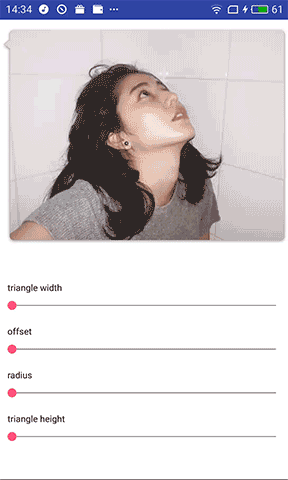

BubbleImageView and BubbleLayout
======================
## [English](README_EN.md)
## [实现原理](http://www.jianshu.com/p/b18c90fdfe0e)

### 安装

若要使用BubbleImageView请在build.gradle 文件下加入以下代码:

```Java
compile 'rouchuan.bubbleview:bubbleImageView:1.0.3'
```

使用BubbleLayout:

```groovy
compile 'rouchuan.bubbleview:bubblelayout:1.0.0'
```

这两个库均未引用任何第三方库，BubbleImageView最低支持api 9，BubbleLayout最低支持api 11。

## BubbleImageView

### ScaleType

支持所有scaleType以及adjustViewBounds，与原生ImageView行为完全一致。


### 自定义



支持自定义以下几种属性

| attrs          | values                | description        |
| :------------- | --------------------- | ------------------ |
| borderColor    | color                 | 边线颜色               |
| offset         | dimension             | 箭头位置偏移量（从上到下，从左到右） |
| borderWidth    | dimension             | 边线宽度               |
| radius         | dimension             | 圆角半径               |
| orientation    | left,right,top,bottom | 箭头朝向               |
| triangleWidth  | dimension             | 箭头底边长              |
| triangleHeight | dimension             | 箭头高度               |
| centerArrow    | boolean               | 箭头居中（会使offset属性失效） |


### 使用

直接在 xml 文件中引用即可:

```xml
<com.ruochuan.bubbleview.BubbleImageView
        android:id="@+id/bubble"
        android:layout_width="match_parent"
        android:layout_height="wrap_content"
        android:adjustViewBounds="true"
        android:src="@drawable/masami"
        app:orientation="top"/>
```


## BubbleLayout

作为ViewGroup使用，相比BubbleImageView，增加了以下两个属性

| attrs        | values  | description |
| ------------ | ------- | ----------- |
| bgColor      | color   | 背景颜色        |
| clipToRadius | boolean | 下面会说明       |


### 使用

子view统一放置在左上角，建议内嵌其他viewgroup实现复杂布局。

```xml
<com.ruochuan.bubblelayout.BubbleLayout
        android:layout_width="wrap_content"
        android:layout_height="wrap_content">
        <TextView
            android:layout_width="wrap_content"
            android:layout_height="wrap_content" 
            android:text="This is a sample"/>
</com.ruochuan.bubblelayout.BubbleLayout>
```


子view计算大小以及放置时默认排除radius的大小，如果想塞满整个view建议将clipToRadius设为true，然后给子view设置一个与bubblelayout相同圆角的backgroundDrawable。

## 接下来要做的事

1. ~~Bubble-ViewGroup~~
2. 支持阴影

## License ##

    Copyright 2017 shenruochuan
    Licensed under the Apache License, Version 2.0 (the "License");
    you may not use this file except in compliance with the License.
    You may obtain a copy of the License at
    
    http://www.apache.org/licenses/LICENSE-2.0
    
    Unless required by applicable law or agreed to in writing, software
    distributed under the License is distributed on an "AS IS" BASIS,
    WITHOUT WARRANTIES OR CONDITIONS OF ANY KIND, either express or implied.
    See the License for the specific language governing permissions and
    limitations under the License.
